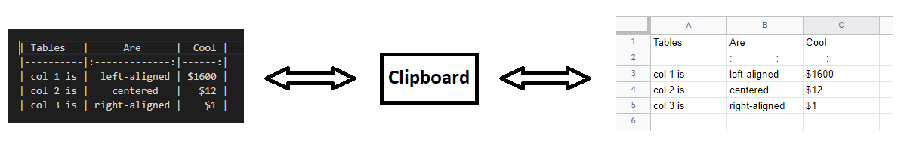

Markdown Table To Excel
=======================

Convert your tables back and forth between Markdown and Excel/Google Sheets via the clipboard.

Tested on Windows, Fedora Linux 38, and macOS Ventura (M1, but compiled binary is amd64).

Usage
-----

1. Copy your table (Ctrl+C)
2. Double click the executable
3. Paste (Ctrl+V)

For convenience, pin the executable in your task bar.

Requirements
------------

On Windows and macOS, there should be none.

On Linux, you need clipboard utilities. For example `xsel`, `xclip`, and `wl-clipboard`.
The application should prompt you.

Development
-----------

1. Clone by running `https://github.com/MasayoshiSugimoto/md-excel-table.git` or `git clone git@github.com:MasayoshiSugimoto/md-excel-table.git`.
2. Build by running  `go build`.
